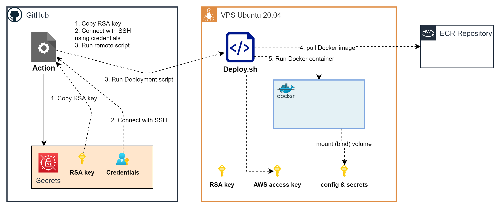

# Deploy

The application is deployed on a remote Linux machine, usually Ubuntu 20.04.  
The machine (Host) should have Docker and needs to download an run the image created and updated by the deployment process.  
The Docker image is created in GitHub Action and pushed on AWS ECR in a private repository.

The Host machine will pull the image an run it in a container (Guest).  
The Guest should be able to access some config/secrets present in the Host machine.  
The deployment process will call a deployment script present in the Host machine.  
In order to do that the GitHub action will use a secret RSA key, secret user credentials and AWS IAM access key stored in GitHub Action secrets.  
The RSA key and the user credentials are required to connect by SSH and execute commands on the Host.
The AWS IAM access key is required to login and push the image on AWS ECR.
To run the deployment script the

## Credentials

**RSA key**: it is the id_rsa (or id_rsa.pub? TODO) of the Host machine.  
Should we use a dedicated RSA key (not the id_rsa)?

The user **credentials** refer to a user that have permissions to execute the deployment script on the Host machine.

The **AWS IAM** is an user that has relevant permissions for ECR login and push on private repository (TODO: "AwsEC2...PowerUser").

## Setup Host machine

Create a user that can execute the script.

## Run the Deployment script

TODO: The deployment script...

TODO: To test it locally we can connect to a local Docker linux container?
